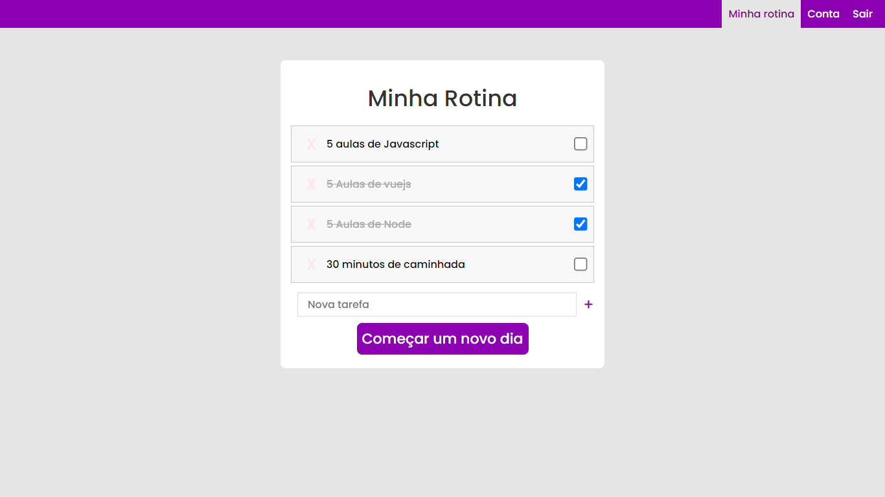

<div align="center">
	
	
	  
  
  

</div>

<h3 align="center">Programa de controle de rotina em PHP</h3>
<p align="center">
  Um programa de controle de rotina, onde através de um cadastro na plataforma é possível fazer o gerenciamento de tarefas que devem ser cumpridas durante um dia.
  <br>
	<a href="https://gabrielogregorio.com/projetos/minha-rotina/"><strong>Ver demonstrativo »</strong></a>
  <br>
	
</p>

<h3>Informações gerais</h3>


### Introdução        
Esse projeto se trata de um estudo de PHP, onde podemos criar uma conta através de e-mail e senha, e podemos então adicionar tarefas que deverão ser cumpridas durante a rotina, como caminhadas, checar e-mails ou assistir uma aula de Javascript por exemplo.

### Como iniciar    
Você precisará de ter o composer habilitado e executar o seguinte comando para instalar o PHPdotenv
```shell
composer require vlucas/phpdotenv
```

Agora crie e configure um arquivo ".env" com base no ".env.example" e forneça suas credenciais de conexão com um banco de dados mysql.

Agora crie o bando de dados e as tabela, alterando para os valores que você definir no seu ".env"
```sql
create DATABASE nome_database;

create table usuarios (
	id int primary key AUTO_INCREMENT,
	login varchar(100) unique,
	senha varchar(60)
)

create table tarefas (
	id int PRIMARY KEY AUTO_INCREMENT,
	id_usuario int not null,
	nome varchar(150),
	marcada boolean,
	FOREIGN key (id_usuario) REFERENCES usuarios(id)
)
```
Pronto, agora você só precisa executar o servidor apache.

### Capturas de tela


